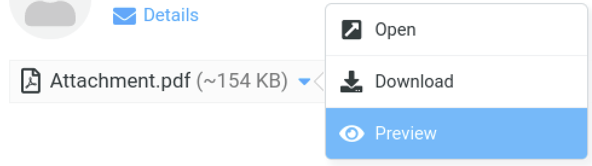

# Roundcube Attachment Preview

Preview attachment in message area instead of new tab.

## Usage
The plugin adds an option to the attachment menu, so you can preview the attachment right within the message area:

## Install
Execute the following lines in your Roundcube plugins folder
~~~
wget -qO- https://github.com/jv-barsuk/roundcube_attachment_preview/archive/refs/heads/main.zip | busybox unzip -; mv roundcube_-_attachment_preview-main attachment_preview
~~~

add the plugin `'attachment_preview',` to the plugins list in your roundcube config file `config/config.inc.php`:
~~~
$config['plugins'] = array(
        'carddav',
        'persistent_login',
        'attachment_preview',
);
~~~
